<div align="center">


<br/>


<br/>

<a href="https://www.linkedin.com/in/mohamedimranlink" target="_blank">
  
</a>
<a href="https://leetcode.com/u/Mohamed-Imran-12/" target="_blank">
  
</a>
<a href="https://github.com/Mohamed-Imran-12" target="_blank">
  
</a>

<br/><br/>


<br/>


</div>

<br/>

<table>
<tr>
<td width="60%" valign="top">

## 🧭 About Me

```yaml
name: "Mohamed Imran"
role: "Final-Year CS Student"
focus: "Full-Stack Development"

currently_learning:
  - Spring Boot ⚙️
  - React ⚛️
  - REST APIs 🔗
  - Data Structures & Algorithms 🧠

interests:
  - Backend Engineering 🔍
  - Clean Architecture 🏗️
  - Scalable Systems 🚀

status: "Open to Open-Source Collaboration 🤝"
```

</td>
<td width="40%">

</td>
</tr>
</table>

<br/>

## ⚡ Tech Arsenal

<div align="center">

**Languages**
<br/>


<br/><br/>

**Frameworks & Databases**
<br/>


<br/><br/>

**Tools & IDEs**
<br/>


</div>

<br/>


## 📊 GitHub Analytics

<div align="center">

<!--
  These cards are generated inside YOUR OWN repo by the workflow file
  .github/workflows/update-cards.yml — they do NOT depend on any
  third-party server, so they can't go down or show broken images.
-->




<br/>


</div>

<br/>

## 🐍 Contribution Snake

<div align="center">


</div>

<br/>


## 🏆 LeetCode Stats

<div align="center">

<a href="https://leetcode.com/u/Mohamed-Imran-12/" target="_blank">
  
</a>

</div>

<br/>


## 🤝 Let's Build Something Together

<div align="center">

I'm always excited to collaborate on **open-source projects**, discuss **clean architecture**, or dive into a good **DSA problem**. Feel free to connect!

<br/>

<a href="https://www.linkedin.com/in/mohamedimranlink" target="_blank">
  
</a>

<br/><br/>


</div>
